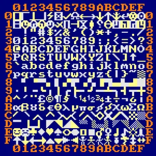

# Dis bonjour

Notre premier programme est très simple, il va demander à l'ordinateur de dire "Bonjour !".
Pour commencer, efface le programme qui est actuellement dans la partie droite de l'éditeur. Pour cela, clique dessus, tapes __CTRL__+__A__ puis sur __BACKSPACE__.

Bien, maintenant tape ceci (ou utilise la technique du _copier/coller_) :

```ts
PRINT("Bonjour ! Je suis ton ordinateur personnel : TLK-74.")
```

Pour exécuter ce programme, c'est-à-dire pour donner l'ordre à ton ordinateur de faire ce qu'il dit, tape sur la touche __F4__.

Le mot [`PRINT`](manual/ins.print) en début de ligne est une __instruction__.
Elle commande à TLK-74 d'écrire sur l'écran (le Moniteur).

Les instructions sont suivies d'__arguments__.
Dans notre cas, il s'agit d'un texte que l'on reconnait parce qu'il est entouré par des guillemets (").
Dans l'éditeur, quand un texte apparait, il est affiché en orange. Les instructions sont en bleu.

Certaines instructions peuvent avoir plusieurs arguments. C'est le cas de `PRINT` qui va écrire tous ses arguments à la suite, comme dans cet exemple :

```ts
PRINT("Je suis ton ordinateur personnel :",  "TLK-", 74, ".")
```

Essaie d'appuyer plusieurs fois sur `F4` pour exécuter plusieurs fois ton programme.

> Wahou ! C'est en train de me remplir l'écran ton truc là.
> Comment je fais pour tout effacer ?

Il faut utiliser une autre instruction :

```ts
CLS()
```

En anglais, c'est l'abréviation de `CLear Screen` (effacer l'écran).

> Et si je veux aller à la ligne avant d'écrire la suite, je fais comment ?

Encore une nouvelle instruction : `PRINTLN()`

```ts
CLS()
PRINTLN("Monsieur le president,")
PRINTLN("Je vous ecris une lettre")
PRINT("Que vous lirez peut-etre...")
```

> Ouch ! ,Ca fait déjà 3 instructions à apprendre.
> On se croierait à l'école là !!
> J'ai l'impression que ça va vite me soûler...

Imagine qu'à chaque nouvel apprentissage ce soit comme apprendre un nouveau sort pour un magicien.
Plus tu as de sorts, et plus tu es puissant.
Ce __manuel__ est un peu comme ton grimoire et tu l'auras sous la main si tu oublies des choses.

À chaque fois que tu apprends un nouveau concept, essaie d'imaginer un petit jeu que tu pourrais faire avec.

[Voir la solution ici](dis-bonjour.1)

C'est ce qu'on appelle de l'ASCII art. Tu peux donc dessiner avec tous les caractères de ton clavier,
mais bien plus encore.

__TLK-74__ connaît 256 caractères numérotés de 0 à 255.
Si tu veux afficher un caractère qui n'est pas sur ton clavier, tu peux utiliser l'instruction `CHR()` avec le numéro que tu veux.

Voici un exemple :

```ts
PRINTLN(CHR(#20,#20,#D6,#D7))
PRINTLN(CHR(#20,#D6,#8F,#8F,#D7))
PRINTLN(CHR(#D6,#8F,#8F,#8F,#8F,#D7))
PRINTLN(CHR(#20,#95,#20,#20,#95))
PRINTLN(CHR(#20,#95,#20,#20,#95))
PRINTLN(CHR(#20,#93,#9A,#9A,#99))
```

> Voilà, je suis encore perdu !
> Tu me parles de nombres entre 0 et 255, et là tu me sorts des `#8F` machin chose...

Et oui ! J'en profite pour te montrer un type de nombres que seuls les informaticiens utilisent :
les __nombres hexadécimaux__. Aux humains, on apprend à utiliser 10 chiffres pour faire des nombres,
mais c'est juste parce qu'on a 10 doigts. Imagine des extra-terrestres avec 16 doigts, et bien ils
utiliseraient 16 chiffres et leurs nombres seraient __hexadécimaux__.

> Et pourquoi pas 13 ou 71 chiffres, pendant qu'on y est ?

Et bien, c'est simplement parce que c'est très pratique pour notre table de 256 caractères.

Si tu regardes le caractère `A` dans la table,
tu vois qu'il est à la __position 65__,
mais aussi qu'il est à la __ligne 4__ et __colonne 1__.



Et par la magie des maths, on a le décimal __65__ qui est égal à l'hexadécimal __#41__.

Du coup, les deux lignes suivantes font la même chose :

```ts
PRINTLN(CHR(65))
PRINTLN(CHR(#41))
```

> Je ne suis pas sûr d'avoir bien compris cette histoire d'hexatruc...

La seule chose à retenir ici, c'est que si tu veux utiliser un caractère un peu cool,
comme un cœur par exemple, il faut utiliser le nombre `#E4` parce que le cœur se trouve
à la ligne __E__ et la colonne __4__ dans la table des caractères.

## Exercice

Voici le programme pour dessiner un petit labyrinthe.

```ts
CLS()
PRINTLN(CHR(#96,#9A,#9E,#9A,#9A,#9C))
PRINTLN(CHR(#95,#94,#91,#94,#94,#95))
PRINTLN(CHR(#95,#95,#96,#99,#93,#9D))
PRINTLN(CHR(#95,#95,#95,#92,#98,#95))
PRINTLN(CHR(#93,#9A,#9B,#9A,#9A,#99))
```

Essaie de le modifier pour en faire un plus grand.

----

* Chapitre suivant : [Les coordonnées](coords)
* Chapitre précédent : [Éditeur et moniteur](editor-monitor)
