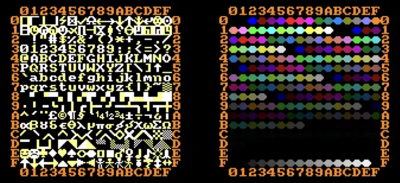
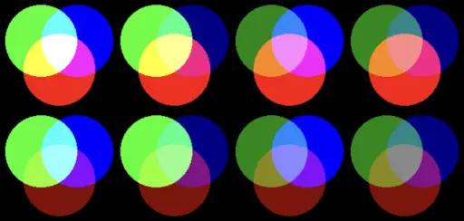

## Ne pas s'emmeler les crayons

Pour dessiner sur l'écran, TLK-74 utilise __256 crayons de couleurs__.

L'instruction `COLOR()` est celle qui permet de dire quel crayon utiliser.

Essaie cet exemple :

```ts
CLS(2)
COLOR(24)
PRINT("Bonjour ")
COLOR(17)
PRINTLN("le monde !")
PRINTLN("Tout ce que j'ecris maintenant est rose.")
```

Comme tu le vois, tu peux aussi effacer l'écran avec le crayon de ton choix.

Et comme pour les symboles, tu peux utiliser les nombres héxadécimaux.
Par exemple `COLOR(24)`, c'est pareil que `COLOR(#18)`.

### Exercice

Essaie d'écrire ton nom en __vert__ sur fond __rouge__.
Pour cela, tu peux essayer des numéros de crayon au hasard,
ou regarder la table des couleurs ci-dessous :



<details>
<summary>Solution...</summary>

```ts
CLS(6)
COLOR(#12)
PRINT("ANSELM LE MAGICIEN DU CODE")
```

</details>

## Changer la couleur d'un crayon

Execute encore une fois le programme d'avant :

```ts
RESET()
CLS(2)
COLOR(24)
PRINT("Bonjour ")
COLOR(17)
PRINT("le monde !")
```

> Attend ! C'est quoi ce RESET() ?

C'est une instruction pour redémarrer la machine.
Comme ça, elle oublie tout ce qu'elle a fait avant.

Et maintenant, exécutes le programme suivant :

```ts
INK(0, 15, 13, 13)
INK(2, 10, 9, 9)
INK(24, 15, 0, 0)
INK(17, 12, 4, 4)
```

> Toutes les couleurs ont changé !

Et oui ! L'instruction INK() sert à changer la couleur d'un crayon.
Et TLK-74 change instantanément la couleur de tout ce qui a déjà été dessiné avec ce crayon.

On a quatre arguments ici :

1. Le numéro du crayon (entre 0 et 255)
2. Le niveau de __rouge__ de la couleur (entre 0 et 15)
3. Le niveau de __vert__ de la couleur (entre 0 et 15)
4. Le niveau de __bleu__ de la couleur (entre 0 et 15)

> Je ne comprends pas... On ne peut faire que du rouge, du vert ou du bleu ?

Oh non ! Avec ça, tu peux faire __4096 couleurs__ différentes.

En fait, derrière chaque pixel de ton écran, il y a trois petites ampoules :
une rouge, une verte et une bleue. Ce sont ces ampoules que tu manipules avec `INK()`.

Une ampoule à 0 est éteinte. À 15, elle est à fond.

Mélanger ces trois lumières primaires te permet de faire tout plein de couleurs.
Mais ça ne fonctionne pas comme en peinture.

Si aucune ampoule n'est allumée (`INK(24, 0, 0, 0)` par exemple), alors le résultat est __noir__.
Si elles sont toutes à fond (`INK(24, 15, 15, 15)`), alors c'est du __blanc__.

Voici un petit diagramme des mélange de couleurs les plus simples :



### Exercice

Change la couleur du crayon 0 pour faire :

1. du orange
2. du violet
3. du marron
