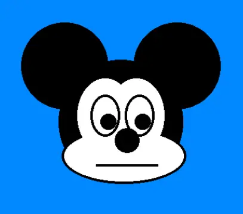

Avec `LOCATE`, on a vu un système de coordonnées bien adapté aux textes.
Mais il existe un autre système, plus fin, qui permet de placer les choses
avec plus de précision.

Essaie ceci, par exemple :

```ts
RESET()
MOVE(0, 0)
PRINT("+")
MOVE(8, 4)
PRINT("+")
MOVE(16, 8)
PRINT("+")
MOVE(24, 12)
PRINT("+")
```

Cette mignonne petite guirlande est faite avec des "+" placés suffisamment près
les uns des autres grâce à l'instruction `MOVE`.

Avec cette instruction, on a __640 colonnes__ et __480 lignes__.

Mais attention ! A la différence de `LOCATE`, la position `0,0` est au centre de l'écran.
Alors qu'avec `LOCATE`, c''etait en haut à gauche.

Ce système de coordonnées est celui qui est le plus utilisé par __TLK-74__.
Car on peut affichier autre chose que du texte.

Par exemple, un cercle (pour faire le drapeau du japon) :

```ts
RESET()
INK(0, 15, 15, 15)
INK(1, 15, 0, 0)
COLOR(1)
MOVE(0,0)
DISK(150)
```

Ou alors, plein de ovales (aussi appelés des ellipses) :

```ts
RESET()
FOR $a IN RANGE(100) {
  COLOR(RANDOM(30))
  MOVE(RANDOM(-320, 320), RANDOM(-240, 240))
  DISK(RANDOM(100), RANDOM(100))
}
```

Ou des rectangles avec la procédure `RECT` :

```ts
RESET()
FOR $a IN RANGE(100) {
  COLOR(RANDOM(30))
  MOVE(RANDOM(-320, 320), RANDOM(-240, 240))
  RECT(RANDOM(100), RANDOM(100))
}
```

Et même du texte de différentes tailles :

```ts
RESET()
FOR $a IN RANGE(100) {
  COLOR(RANDOM(30))
  MOVE(RANDOM(-320, 320), RANDOM(-240, 240))
  LABEL("Anselm & Alois", RANDOM(100) / 10)
}
```

Et quand on compine plusieurs ellipses, on peut dessiner un bonhomme :

```ts
RESET()
MOVE(0, 0)
DISK(200)
REM Le contour des yeux
COLOR(1)
MOVE(60, 60)
DISK(31, 51)
MOVE(-60, 60)
DISK(31, 51)
REM Le blanc des yeux
COLOR(26)
MOVE(60, 60)
DISK(30, 50)
MOVE(-60, 60)
DISK(30, 50)
REM Le bleu des yeux
COLOR(2)
MOVE(60, 40)
DISK(20, 30)
MOVE(-60, 40)
DISK(20, 30)
REM La Bouche
COLOR(7)
MOVE(0, -100)
DISK(100, 40)
COLOR(24)
MOVE(0, -80)
DISK(120, 40)
```

Amuse-toi à modifier ce programme tant que tu veux.
Examine surtout comment on dessine la bouche.
Et quand tu as bien compris, essaie de le remettre à l'en droit.

## Exercice

Essaie de faire une tête de Mickey en noir et blanc.



<details>
<summary>Solution...</summary>

```ts
RESET()
CLS(11)
$x = 0
$y = 0
$noir = 27
$blanc = 26
color($noir)
rem Cheveux
move($x,$y)
disk(100)
rem Oreilles
MOVEr(-90, -90)
DISK(70)
MOVER(180,0)
disk(70)
mover(-90,90)
rem Visage (bas)
mover(5,55)
color($noir)
disk(100,45)
color($blanc)
disk(96,41)
mover(-5,-55)
rem Visage (haut)
mover(-25,-10)
color($blanc)
disk(45,60)
mover(50,0)
disk(45,60)
mover(-25,10)
REM Oeil gauche
mover(-25,-10)
COLOR($noir)
disk(24,34)
COLOR($blanc)
disk(20,30)
color($noir)
mover(5,10)
disk(13)
mover(25,0)
REM Oeil droit
mover(25,-10)
COLOR($noir)
disk(24,34)
COLOR($blanc)
disk(20,30)
color($noir)
mover(5,10)
disk(13)
mover(-25,10)
rem Nez
mover(0,20)
color($noir)
disk(20)
mover(0,-20)
rem Bouche
mover(0, 60)
color($noir)
rect(50,2)
```

</details>
