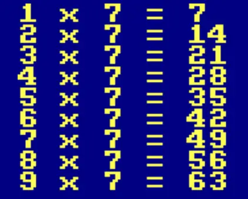
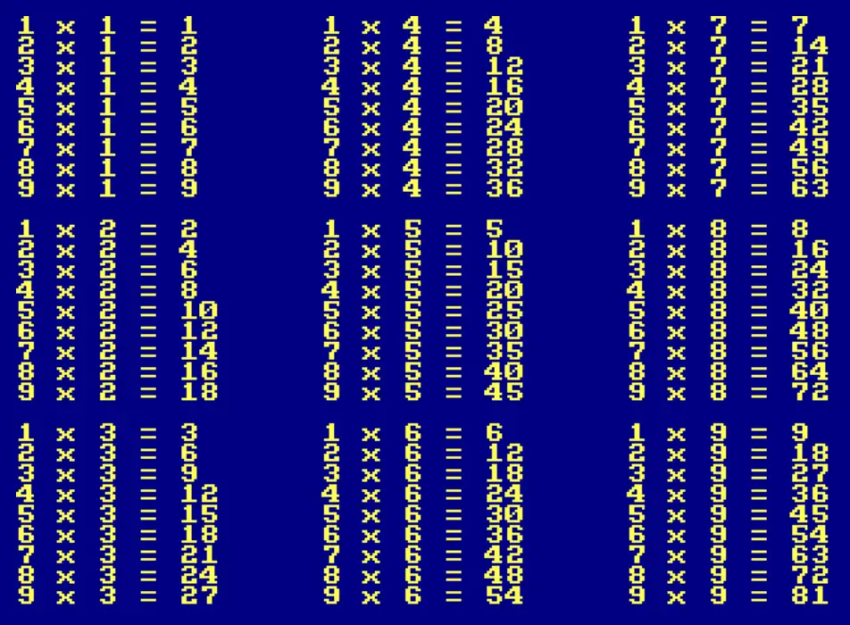

# Écrire du texte où on veut

Essaie ceci :

```ts
CLS()
PRINT(CHR(#F9))
LOCATE(1,1)
PRINT("Hortense")
LOCATE(2,2)
PRINT("Ortense")
LOCATE(3,3)
PRINT("Rtense")
LOCATE(4,4)
PRINT("Tense")
LOCATE(5,5)
PRINT("Ense")
LOCATE(6,6)
PRINT("Nse")
LOCATE(7,7)
PRINT("Se")
LOCATE(8,8)
PRINT("E")
```

Comme tu le vois, il est possible d'écrire du texte à un endroit précis grâce à
l'instruction `LOCATE()`.

Elle attend deux arguments qu'on appelle __coordonnées__.
Le premier argument donne la colonne et le deuxième la ligne.
Sur l'écran, il y a __40 colonnes__ et __30 lignes__.

Ainsi, le numéro de colonne va de __0 à 39__ et le numéro de ligne va de __0 à 29__.

Voici comment placer de "coins" dans chaque coin de l'écran :

```ts
CLS()
LOCATE(0,0)
PRINT(CHR(#96))
LOCATE(39,0)
PRINT(CHR(#9C))
LOCATE(0,29)
PRINT(CHR(#93))
LOCATE(39,29)
PRINT(CHR(#99))
```

Si je veux rajouter des lignes horizontales, je peux écrire quelque chose comme ça :

```ts
CLS()
LOCATE(0,0)
PRINT(CHR(#96,#9A,#9A,#9A,#9A,#9A,#9A,#9A,#9A,#9A,#9A,#9A,#9A,#9A,#9A,#9A,#9A,#9A,#9A,#9A,#9A,#9A,#9A,#9A,#9A,#9A,#9A,#9A,#9A,#9A,#9A,#9A,#9A,#9A,#9A,#9A,#9A,#9A,#9A,#9C))
LOCATE(0,29)
PRINT(CHR(#93,#9A,#9A,#9A,#9A,#9A,#9A,#9A,#9A,#9A,#9A,#9A,#9A,#9A,#9A,#9A,#9A,#9A,#9A,#9A,#9A,#9A,#9A,#9A,#9A,#9A,#9A,#9A,#9A,#9A,#9A,#9A,#9A,#9A,#9A,#9A,#9A,#9A,#9A,#99))
```

Mais c'est un peu long à taper...

Il faudrait au moins ne taper la longue ligne qu'une seule fois.
Pour cela, on pourrait lui donner un nom, plus court à taper, et l'utiliser autant de fois qu'on veut.

Pour commencer, essayons d'écrire _"Anselm est un magicien en devenir"_ sur la première ligne et sur la dernière.
On peut utiliser la manière longue :

```ts
CLS()
LOCATE(0,0)
PRINT("Anselm est un magicien en devenir")
LOCATE(0,29)
PRINT("Anselm est un magicien en devenir")
```

Et maintenant la manière courte, en utilisant une __variable__.

```ts
CLS()
$phrase = "Anselm est un magicien en devenir"
LOCATE(0,0)
PRINT($phrase)
LOCATE(0,29)
PRINT($phrase)
```

L'instruction `$truc = "Bidule"` signifie que partout où TLK-74 verra `$truc`, il doit le remplacer par `"Bidule"`.
On l'avait djà vu avec l'instruction `ASK()`.

```ts
$nom = ASK("Ton nom, petit ? ")
PRINTLN("Salut ", $nom)
```

Tout ce qui commence par un dollar (`$`) est ce qu'on appelle une __variable__.
Tu peux aussi voir ça comme la mémoire de TLK-47.
La première ligne du programme juste au dessus signifie :
_demande la nom au joueur et met le dans un tiroir appelé `$nom`_.

Et la deuxième ligne veut dire : _affiche "Salut" suivi de ce qu'il y a en ce moment dans le tiroir ppelé `$nom`"_.

Utilisons ce comcept avec nos lignes d'avant :

```ts
CLS()
$ligne = CHR(#9A,#9A,#9A,#9A,#9A,#9A)
LOCATE(0,0)
PRINT(CHR(#96), $ligne, CHR(#9C))
LOCATE(0,29)
PRINT(CHR(#93), $ligne, CHR(#99))
```

C'est mieux, mais je n'ai pas mis assez de `$9A,`. Il y en faut 38, mais la bonne nouvelle c'est qu'on a une autre astuce pour ça :

```ts
CLS()
$ligne = CHR(#9A) * 38
LOCATE(0,0)
PRINT(CHR(#96), $ligne, CHR(#9C))
LOCATE(0,29)
PRINT(CHR(#93), $ligne, CHR(#99))
```

> Hé ! Mais il manque les lignes verticales. On fait comment ?

C'est un poil plus compliqué à comprendre, mais le code est assez court :

```ts
CLS()
$ligne = CHR(#9A) * 38
LOCATE(0,0)
PRINT(CHR(#96), $ligne, CHR(#9C))
LOCATE(0,29)
PRINT(CHR(#93), $ligne, CHR(#99))

$vide = " " * 38
$bord = CHR(#95) + $vide + CHR(#95)
LOCATE(0,1)
PRINT($bord * 28)
```

## Exercices

Écris un programme qui affiche la table du 7. tu devrais avoir quelque chose comme ça :



Je te conseille d'utiliser `FOR $value IN RANGE(1, 9)` si tu ne veux pas écrire 9 fois la mēme chose.

<details>
<summary>Solution...</summary>

```ts
RESET()
FOR $valeur IN RANGE(1, 9) {
    PRINTLN($valeur, " x 7 = ", $valeur * 7)
}
```

</details>

Et maintenant, écris un programme qui affiche toutes les tables de 1 à 9, comme dans l'image suivante :



<details>
<summary>Solution...</summary>

```ts
RESET()
$x = 0
$y = 0
FOR $table IN RANGE(1, 9) {
  IF $table == 4 {
    $x = 15
    $y = 0
  }
  IF $table == 7 {
    $x = 30
    $y = 0
  }
  FOR $valeur IN RANGE(1, 9) {
    LOCATE($x, $y)
    PRINT($valeur, " x ", $table, " = ", $valeur * $table)
    $y = $y + 1
  }
  $y = $y + 1
}
```

</details>
